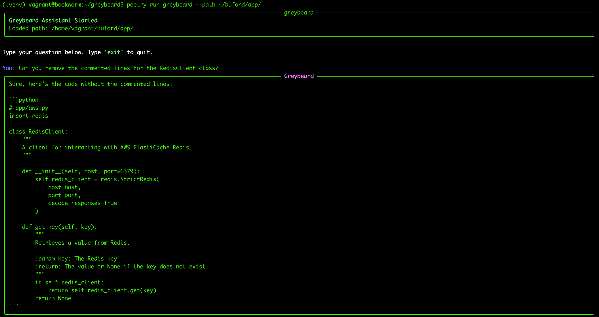

# 🧙 Greybeard

**Greybeard** is a terminal-native AI assistant for infrastructure engineers. It analyzes your codebase using OpenAI's GPT models and gives actionable suggestions — with inline diffs and the ability to apply changes directly from the terminal.

---

## 🚀 Features

- GPT-4-powered CLI assistant
- Automatic project context loading
- Intelligent file ignore system (`.greybeardignore`)
- Suggestion review: preview, apply, or skip
- JSON diff-based patching
- File-based suggestion history
- Python 3.11 compatible

---
## 📦 Requirements

- Python 3.11+
- [Poetry](https://python-poetry.org/docs/)
- An OpenAI API key

---

## 🛠 Setup

```bash
git clone git@github.com:your-username/greybeard.git
cd greybeard
python3.11 -m venv .venv
source .venv/bin/activate
poetry install
poetry env use .venv/bin/python
export OPENAI_API_KEY="sk-..."
```

---

## 💬 Usage

### 🧭 Basic Command

```bash
poetry run greybeard chat --path .
```

### 🧾 Options

| Flag     | Description                          | Default |
|----------|--------------------------------------|---------|
| `--path` | Root path to analyze for context     | `.`     |
| `--help`| Show help message                    |         |

### 🧠 Example

You can ask Greybeard:

- `Suggest a refactor for my Terraform output blocks`
- `How can I modularize this Helm chart?`
- `Propose a logging abstraction for main.tf`
- `Is there a better way to structure my ECS task definition?`

### 📘 Sample Interaction




## 🧪 Run Tests

```bash
poetry run pytest
```

Covers:
- Suggestion models
- Suggestion store (save/load)
- GPT reply parsing

---

## 🔐 API Access

You'll need an [OpenAI API key](https://platform.openai.com/account/api-keys). Set it like this:

```bash
export OPENAI_API_KEY="sk-..."
```

---

## 📄 License

MIT. Use freely and adapt for internal tools or custom workflows.

---

## 🤝 Contributing

Greybeard is in early development. Feature suggestions, issues, and PRs are welcome!

Planned features:
- Persistent chat session history
- Undo/redo change journal
- Multi-suggestion batching
